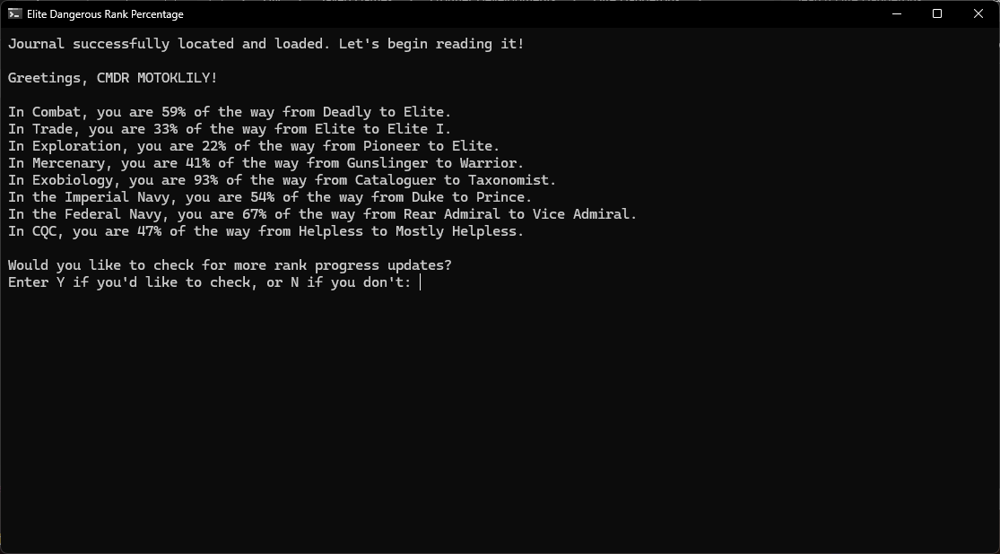
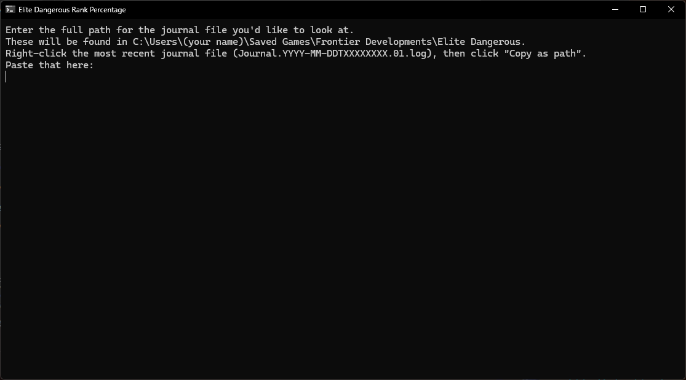

# Elite Dangerous Rank Percentage Visualizer
## Welcome!
Welcome and o7! I'm CMDR lilykmoto. I found it annoying that Elite Dangerous doesn't give you a percentage value for your career ranks, despite storing that in the journal file. This program aims to solve that. If you give it a journal file, it will parse the journal file and tell you how close you are to the next rank!

## Program Usage
This program is very simple to use. Give it a journal file, and it will give you your percentages.
### Initial Input

The program will prompt you to give it the path to the journal file you'd like to look at. By default, these are stored at `C:\Users\[USERNAME]\Saved Games\Frontier Developments\Elite Dangerous`. To get that file path, you can either:
1. Drag and drop the file into the console window (but if you do this, make sure to click back in the terminal window, otherwise pressing enter will cause the file to open!)
1. Right click the file and click "Copy as Path". Then, paste that into the console window.

Note: you *do not* have to remove the quotation marks.

Once the file path is in the program, press enter. The program will greet you by your CMDR name and pull your latest rank percentages.

### Checking for More Progress
If you would like to check for further progression in the same file, quit to the main menu in Elite and log back in to Open, Private Group, or Solo. It doesn't matter which. Progress values are only written once you either initially log in or relog. Once you're back in your ship, enter "Y" (lowercase or capital, it doesn't matter), and the program will output your new percentages.

## Closing

I'd appreciate it if you could give me feedback on the program! I'd also love to hear if you have any ideas that I could add to the program! If you encountered any bugs, I'd love to hear about those too! If you'd like to say anything about the program, feel free to fill out [this Google form.](https://forms.gle/MtJnFgNgtidePRE67)

Thank you so much!

o7 CMDR.